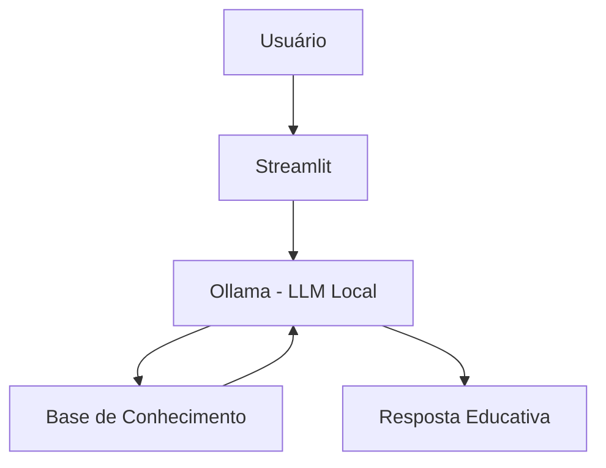

# 🪙 Nico - Seu Tradutor Financeiro Inteligente

> Agente de IA Generativa que traduz o economês e ensina conceitos de finanças pessoais de forma simples e descontraída, usando os próprios dados dos clientes como exemplos práticos.

## 💡 O Que é o Nico?


O Nico é um educador financeiro focado em iniciantes que **ensina**, não recomenda. Ele descomplica conceitos como liquidez, inflação e juros, ajudando o aluno a organizar seu orçamento com o método dos três potes (50/30/20) usando uma abordagem leve e cheia de analogias do dia a dia.

**O que o Nico faz:**
- ✅ Explica conceitos financeiros difíceis usando analogias simples (sem economês)
- ✅ Usa dados do aluno como exemplos práticos para o método 50/30/20
- ✅ Responde dúvidas sobre produtos financeiros básicos de Renda Fixa
- ✅ Analisa padrões de gastos de forma exclusivamente educativa

**O que o Nico NÃO faz:**
- ❌ Não recomenda investimentos específicos (ações, marcas, bancos ou corretoras)
- ❌ Não acessa dados bancários sensíveis em tempo real
- ❌ Não substitui um consultor ou profissional certificado

## 🏗️ Arquitetura



**Stack:**
- Interface: Streamlit
- LLM: Ollama (modelo local `gpt-oss`)
- Dados: JSON/CSV + Dicionário de Analogias mockados

## 📁 Estrutura do Projeto

```
├── data/                          # Base de conhecimento
│   ├── perfil_investidor.json     # Perfil do cliente
│   ├── transacoes.csv             # Histórico de gastos recentes
│   ├── historico_atendimento.csv  # Interações e progresso anterior
│   ├── produtos_financeiros.json  # Lista de produtos para ensino
│   └── dicionario_analogias.json  # Regras de analogias do Nico
│
├── docs/                          # Documentação completa
│   ├── 01-documentacao-agente.md  # Caso de uso e persona do Nico
│   ├── 02-base-conhecimento.md    # Estratégia e modelagem de dados
│   ├── 03-prompts.md              # System prompt e tratamento de exceções
│   ├── 04-metricas.md             # Plano de avaliação e testes locais
│   └── 05-pitch.md                # Apresentação de negócios do projeto
│
└── src/
    └── app.py                     # Aplicação Streamlit
```

## 🚀 Como Executar

### 1. Instalar Dependências

```bash
pip install streamlit pandas groq
```

### 2. Navegar até a pasta raiz em que o projeto foi salvo
```bash 
cd "Caminho/Ate/A/Pasta/Projeto"
```

### 3. Rodar o app
```bash
python -m streamlit run src/app.py
```

## 🎯 Exemplo de Uso

**Pergunta:** "Nico, o que é liquidez?"  
**Nico:** "Pensa na liquidez como o estepe do seu carro: é a facilidade de pegar o seu dinheiro de volta quando acontece uma emergência na estrada. Um investimento com 'liquidez diária' significa que você consegue resgatar o dinheiro no mesmo dia, sem perder nada. Faz sentido?"

**Pergunta:** "Onde estou gastando mais?"  
**Edu:** "Fazendo um raio-x nos seus gastos de maio, vi que sua maior saída foi com Moradia (R$ 1.200), seguida de alimentação (R$ 650). Se jogarmos isso na regra dos três potes (50/30/20), seus gastos essenciais estão consumindo boa parte da sua renda. Que tal darmos uma olhada em como equilibrar isso?"

## 📊 Métricas de Avaliação

| Métrica | Objetivo |
|---------|----------|
| **Assertividade** | O agente responde o que foi perguntado e explica o conceito usando analogias claras e corretas?? |
| **Segurança (Anti-Dica)** | O agente se recusa a dar recomendações de compra ou indicar marcas? |
| **Coerência** | A linguagem se mantém amigável na conversa e respeitosa nos limites? |

## 🎬 Diferenciais

- **Dicionário de Analogias:** Garante que termos complexos sejam traduzidos de forma visual e simples (ex: inflação = monstrinho do mercado).

- **Abordagem Educativa:** Bloqueio rígido contra recomendações diretas, focado no desenvolvimento da autonomia do aluno.

- **100% Local:** Privacidade total rodando via Ollama, sem enviar dados financeiros para APIs de terceiros.

- **Tratamento Respeitoso:** Postura firme, neutra e educada para lidar com desvios de escopo e tentativas de jailbreak.

## 📝 Documentação Completa

Toda a documentação técnica, estratégias de prompt e casos de teste estão disponíveis na pasta [`docs/`](./docs/).